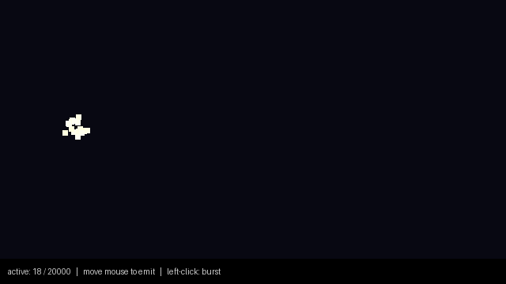
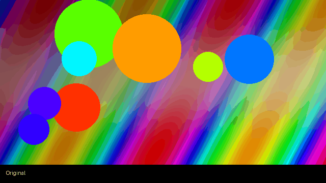
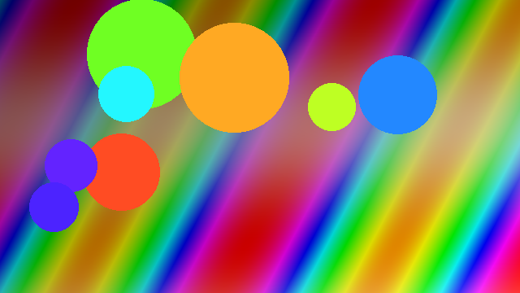
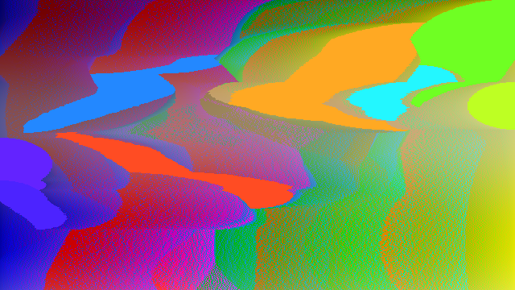
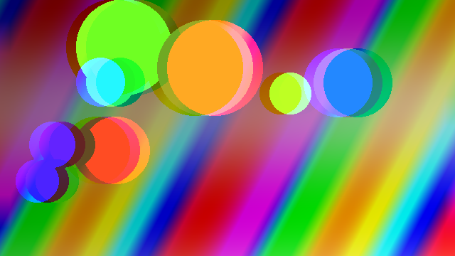
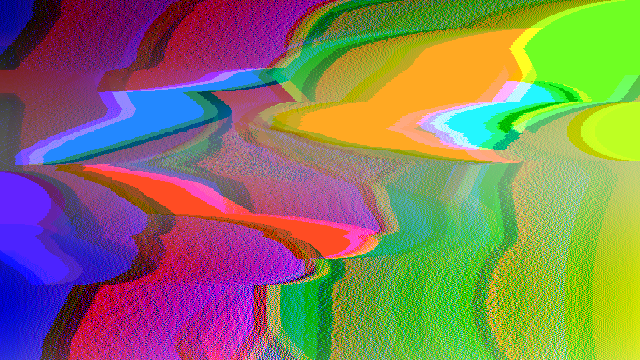

# C++ Showcase Projects

Two high-performance C++ tools demonstrating OOP, memory management, and systems programming.

---

# 🎮 Particle Simulation



[](https://github.com/KyleH777/C--/actions/workflows/particle_sim.yml)

A real-time 2D particle fountain built with **C++20** and **SFML**, rendering up to 20 000 particles in a single GPU draw call.

---

## Architecture

### Class Diagram

```
┌──────────────────────────────────┐       ┌──────────────────────────────────────────────────────────┐
│            Particle              │       │                    ParticleSystem                        │
│          (data struct)           │       │               (extends sf::Drawable)                     │
├──────────────────────────────────┤       ├──────────────────────────────────────────────────────────┤
│ + position    : sf::Vector2f     │       │ - m_emitter      : sf::Vector2f                          │
│ + velocity    : sf::Vector2f     │  1..* │ - m_particles    : std::vector<Particle>  ← pre-reserved │
│ + color       : sf::Color        │◄──────│ - m_vertices     : sf::VertexArray (Quads)               │
│ + lifetime    : float            │       │ - m_maxParticles : const std::size_t                     │
│ + maxLifetime : float            │       │ - m_rng          : std::mt19937                          │
│ + size        : float            │       ├──────────────────────────────────────────────────────────┤
├──────────────────────────────────┤       │ + ParticleSystem(maxParticles)                           │
│ + isAlive()   : bool             │       │ + setEmitter(pos)                                        │
│ + lifeRatio() : float  [0 → 1]   │       │ + emit(count)                                            │
└──────────────────────────────────┘       │ + update(dt)                                             │
                                           │ + activeCount() / maxCapacity()                          │
                                           ├──────────────────────────────────────────────────────────┤
                                           │ - draw(target, states)   [sf::Drawable override]         │
                                           │ - resetParticle(p)                                       │
                                           │ - rebuildVertices()                                      │
                                           └──────────────────────────────────────────────────────────┘
```

**`Particle`** is a plain data struct — no vtable, no heap allocation, stored by value in a contiguous array.

**`ParticleSystem`** inherits `sf::Drawable` so callers write `window.draw(particles)` — the system handles batching internally.

---

## `std::vector` and `reserve()` — Why It Matters

```cpp
// ── Constructor ───────────────────────────────────────────────────────────────
ParticleSystem::ParticleSystem(std::size_t maxParticles)
    : m_maxParticles(maxParticles)
{
    m_particles.reserve(maxParticles);  // ← the single most important call
}
```

Without `reserve()`, `std::vector` starts with zero capacity and **doubles** every time `size()` reaches `capacity()`. Each doubling triggers:

| Step | Cost |
|---|---|
| `malloc()` | Allocates a new, larger contiguous block |
| move/copy | Relocates every existing `Particle` to the new block |
| `free()` | Releases the old block |

In a 60 Hz game loop this means random, unpredictable frame spikes — exactly when you can least afford them.

`reserve(maxParticles)` eliminates all of that:

```
Without reserve()                    With reserve(20'000)
─────────────────────                ─────────────────────────────────
capacity: 0 → 1 → 2 → 4 → 8 …       capacity: 20'000 from frame 1
15+ reallocations before             0 reallocations ever
reaching 20 000 particles

Hot-path per push_back:              Hot-path per push_back:
  sometimes: malloc + N moves          always: write 1 Particle (≈ 40 B)
  always:    write 1 Particle
```

Because the vector never reallocates, the memory layout remains a single contiguous block — the CPU's prefetcher can stream through `m_particles` at full memory bandwidth.

---

## Batch Rendering with `sf::VertexArray`

The naive approach calls `window.draw(circle)` for each particle — N separate draw calls, N GPU state changes:

```
Naive (N = 10 000 particles):        Batch (always):
  draw(circle[0])                      draw(m_vertices)   // one call
  draw(circle[1])                      // submits 40 000 vertices at once
  …
  draw(circle[9999])
  // 10 000 GPU state changes!
```

`ParticleSystem` maintains a `sf::VertexArray` of `sf::Quads` (4 vertices per particle). `rebuildVertices()` writes the positions and colours every frame in a cache-friendly linear pass, then `draw()` submits the whole array in a single call.

---

## CMakeLists.txt — Cross-Platform SFML Setup

```cmake
cmake_minimum_required(VERSION 3.20)
project(particle_sim CXX)
set(CMAKE_CXX_STANDARD 20)

# Step 1 ── Pull SFML from GitHub, pinned to a specific release.
#           No system install needed on any platform.
include(FetchContent)
FetchContent_Declare(
    SFML
    GIT_REPOSITORY https://github.com/SFML/SFML.git
    GIT_TAG        2.6.1       # change tag here to upgrade
    GIT_SHALLOW    TRUE        # only fetch this commit, saves bandwidth
)

# Step 2 ── Disable modules we don't use (saves ~60 s of compile time).
set(SFML_BUILD_AUDIO   OFF CACHE BOOL "" FORCE)
set(SFML_BUILD_NETWORK OFF CACHE BOOL "" FORCE)

FetchContent_MakeAvailable(SFML)

# Step 3 ── Define the target.
add_executable(particle_sim src/main.cpp src/ParticleSystem.cpp)
target_include_directories(particle_sim PRIVATE include)

# Step 4 ── Link. SFML 2.x uses lowercase target names when built from source.
target_link_libraries(particle_sim PRIVATE
    sfml-graphics   # sf::RenderWindow, sf::VertexArray, sf::Color …
    sfml-window     # sf::Event, sf::Mouse …
    sfml-system     # sf::Vector2f, sf::Clock …
)

# Step 5 ── Copy DLLs next to the .exe on Windows (required at runtime).
if(WIN32)
    add_custom_command(TARGET particle_sim POST_BUILD
        COMMAND ${CMAKE_COMMAND} -E copy_if_different
            $<TARGET_RUNTIME_DLLS:particle_sim>
            $<TARGET_FILE_DIR:particle_sim>
        COMMAND_EXPAND_LISTS
    )
endif()
```

**Why `FetchContent` beats `find_package`** for cross-platform work:

| | `find_package` | `FetchContent` |
|---|---|---|
| Requires system SFML | Yes | No |
| Works on fresh CI runner | Only if pre-installed | Always |
| Version pinned | No (uses whatever's installed) | Yes (`GIT_TAG`) |
| Works on Windows/macOS/Linux unchanged | Often not | Yes |

---

## Build

```bash
cd particle_sim
cmake -B build -DCMAKE_BUILD_TYPE=Release
cmake --build build -j$(nproc)
./build/particle_sim          # Linux/macOS
.\build\Release\particle_sim  # Windows
```

## Controls

| Input | Action |
|---|---|
| Move mouse | Move emitter |
| Left-click (hold) | Burst mode (3× emission rate) |
| `ESC` | Quit |

---

# 🎨 Glitch Art



[](https://github.com/KyleH777/C--/actions/workflows/glitch_art.yml)

A C++20 CLI tool for applying **pixel-sort** and **chromatic aberration** effects to images.

## Gallery

| Original | Pixel Sort |
|:---:|:---:|
|  |  |
| **Chromatic Aberration** | **Both Effects** |
|  |  |

## Build & Usage

```bash
cd glitch_art
cmake -B build -DCMAKE_BUILD_TYPE=Release
cmake --build build -j$(nproc)

./build/glitch_art photo.jpg out.png --sort
./build/glitch_art photo.jpg out.png --aberration 12
./build/glitch_art photo.jpg out.png --sort --aberration 8
```
